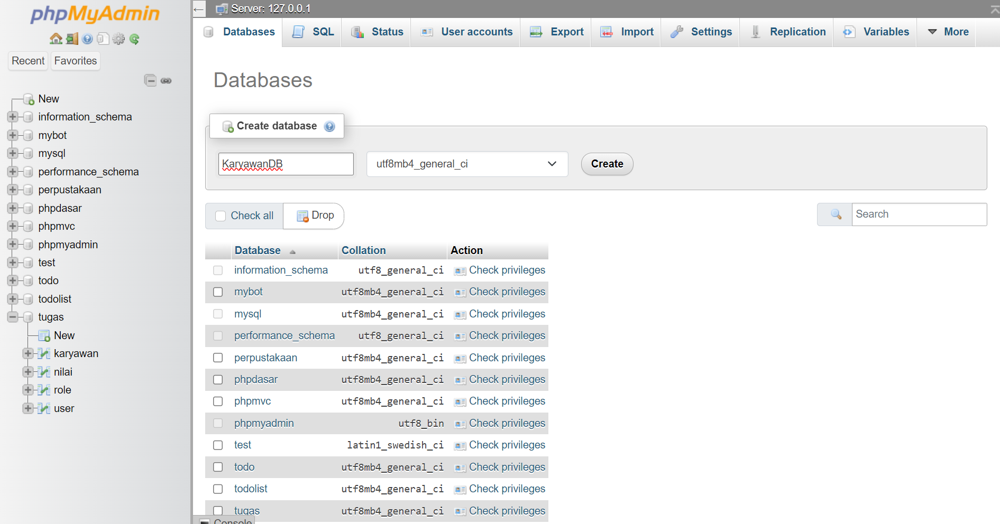
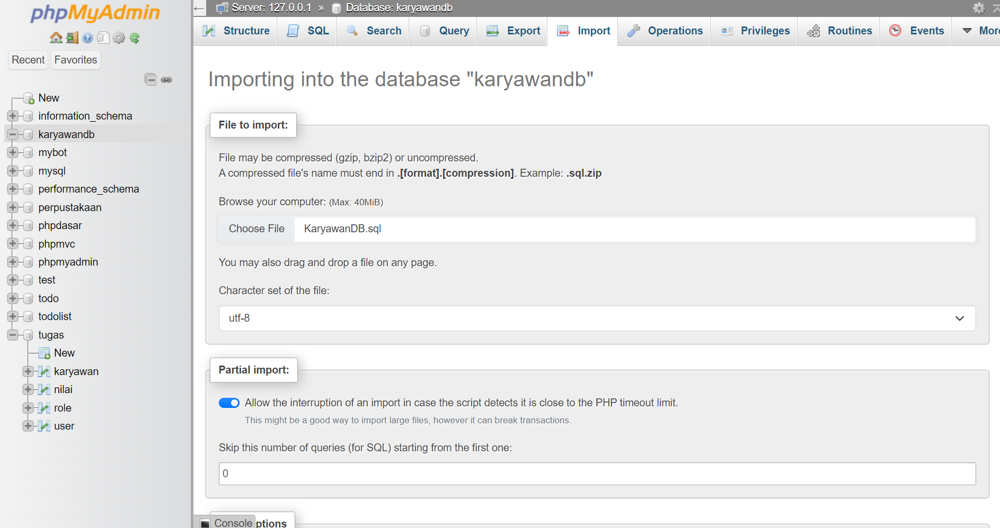

# Website Karyawan PHP Composer
> Website Berbasis PHP

<p align="center" widh="100%">
 
</p>

Ini adalah sebuah website pengelolaan karyawan sederhana yang dibuat menggunakan 
bahasa pemrograman php dan javascript serta framework css berupa bootstrap.


> [!NOTE]
> Sebelum Mengclone Pastikan PHP Sudah Terinstall Secara Manual di OS Anda Dan Sudah Import KaryawanDB.sql ke dalam MYSQL ANDA.


## How To Import SQL

> Create Database 

<p align="center" widh="100%">
 
</p>

> Import SQL

<p align="center" widh="100%">
 
</p>

## Clone This Project

```
git clone https://github.com/SyaPratama/Karyawan-MVC.git
```

```
cd Karyawan-MVC
```

```
composer update
```

```
cd public
php -S 127.0.0.1:8080
```

> Project Karyawan Sudah Bisa Dijalankan 


## Do You Need Installation

- Installation
  - [PHP](https://www.php.net/)
  - [Javascript](https://developer.mozilla.org/en-US/docs/Web/JavaScript)
  - [Bootstrap](https://getbootstrap.com/)
  - [SweetAlert](https://sweetalert2.github.io/#icons)
  - [JQuery](https://jquery.com/)
  - [Composer](https://getcomposer.org/)


## Thanks To Follow :octocat:

